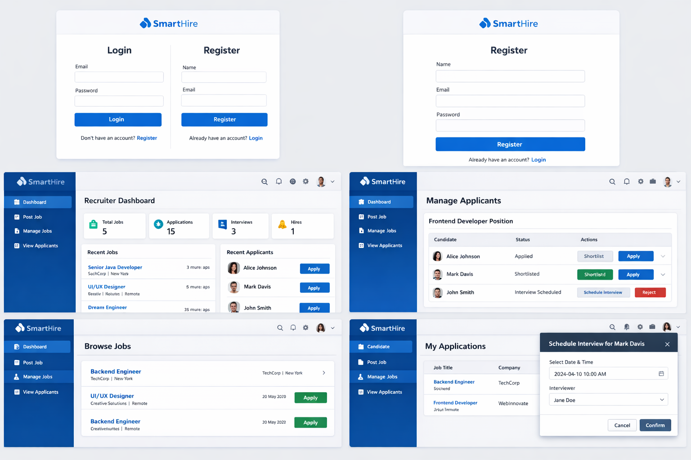

# SmartHire

SmartHire is a full‑stack recruitment platform that helps **recruiters** post and manage jobs and enables **candidates** to browse openings, apply, and track applications. The UI includes role‑based dashboards for a clean hiring workflow.

## Features
- JWT Authentication with role‑based access (Recruiter / Candidate)
- Recruiter Dashboard: job posting, job management, applicant tracking
- Candidate Experience: browse jobs, apply, view application status
- Applicant Management: shortlist / reject, schedule interview (UI)
- Responsive modern UI (React)

## Tech Stack
- **Frontend:** React, React Router, Context API, Axios  
- **Backend:** Spring Boot (Java 17), Spring Security, JWT, JPA/Hibernate  
- **Database:** MySQL / PostgreSQL

## Screenshots


## Run Locally

### 1) Clone
```bash
git clone https://github.com/<your-username>/SmartHire.git
cd SmartHire
```

### 2) Frontend
```bash
cd frontend
npm install
npm start
```

### 3) Backend
```bash
cd backend
mvn clean install
mvn spring-boot:run
```

## Project Status
Actively developed — new features and improvements are being added.

## Author
Yashwanth Dodda
